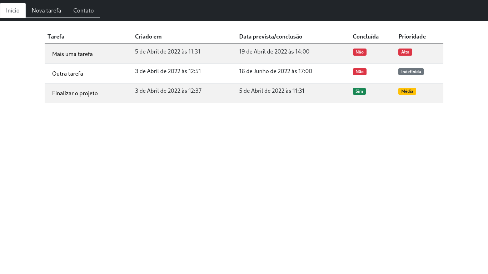
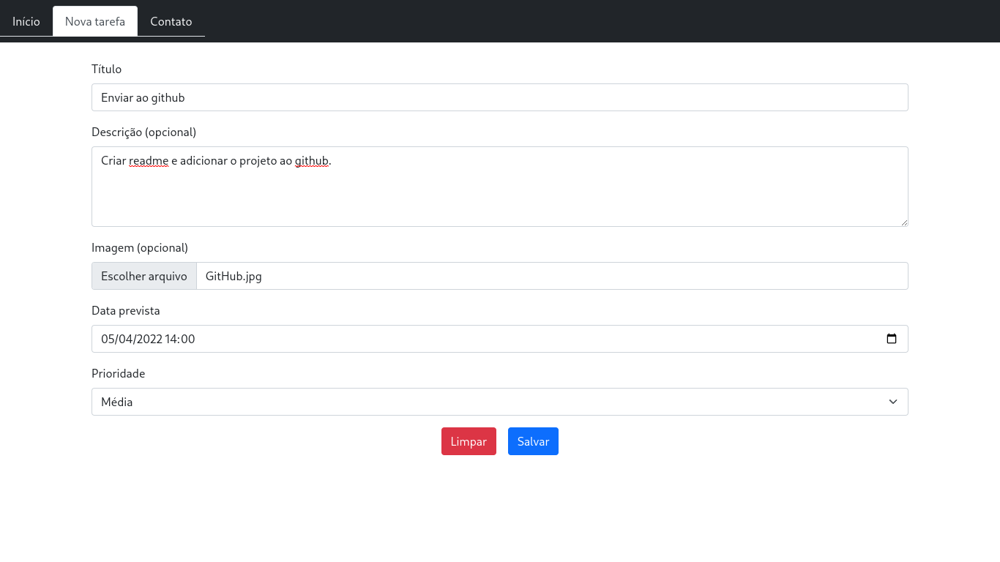
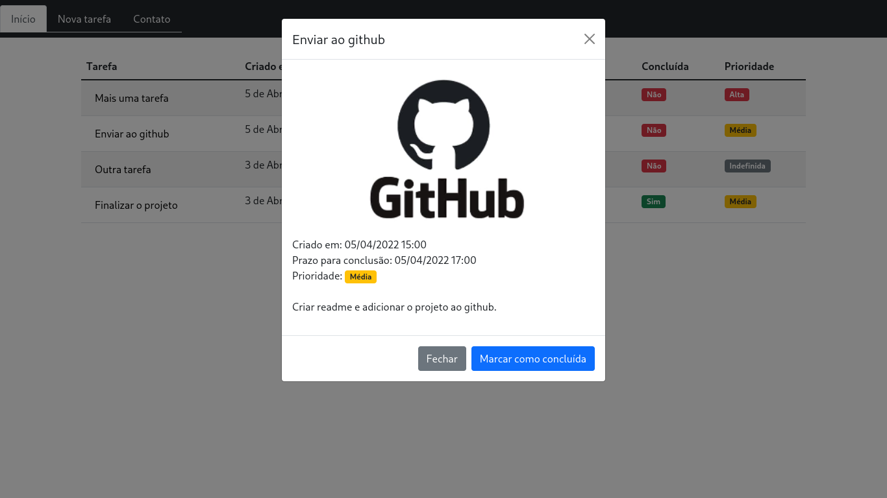
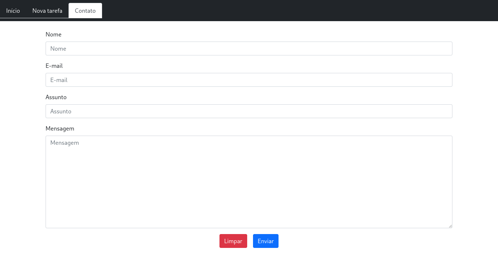

# TO-DO List

Projeto pessoal feito para praticar conceitos vistos no curso de Django da Geek University (seção 4), nele é possível cadastrar tarefas e visualizar tarefas na ordem em que desejar. Podendo adicionar título, descrição, datas, prioridades e imagem à elas.

# Tecnologias usadas
Para a construção do projetos usei Python/Django, MySQL, com auxílio do javacript para alguns comportamentos e o Bootstrap para o visual.

  
  
  
  
  

## Screnshots
- Página inicial

- Nova tarefa

- Detalhes da tarefa

- Formulário de contato

